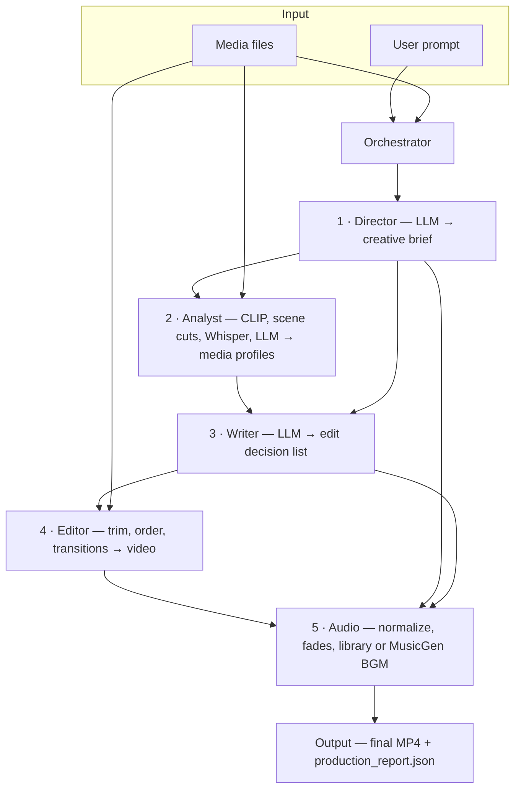

# Agentic Production House

Turn **your** video clips and images plus a **text prompt** into a single edited video (about **15–90 seconds**), with pacing, transitions, optional background music, and a JSON **production report** that explains the edit plan.

---

## How it works

An **orchestrator** runs a fixed pipeline. **Reasoning** (LLM + structured JSON) is separate from **execution** (MoviePy / FFmpeg).



1. **Director** — Reads your prompt with an LLM and outputs a creative brief (mood, pacing, structure, target length).
2. **Analyst** — Profiles each file: optional **CLIP** on sampled frames, **scene detection**, optional **Whisper** on audio, then an LLM summary and relevance score.
3. **Writer** — LLM builds an **edit decision list** (which file, in/out times, transitions, short reasoning).
4. **Editor** — Cuts and assembles the video with **MoviePy** / **FFmpeg** (no new footage—only your media).
5. **Audio** — Loudness normalization, fades, optional **your** music from a folder, or optional **MusicGen**-synthesized underscore if enabled.

*(If the diagram does not render, use a Markdown viewer or GitHub that supports **Mermaid**.)*

---

## What you need

- **Python 3.9+** (3.10+ recommended)
- **FFmpeg** on your `PATH` (e.g. `brew install ffmpeg` on macOS)
- **LLM**: **[Ollama](https://ollama.com)** locally (default) **or** OpenAI-compatible API
- **GPU**: Optional but strongly recommended for CLIP, Whisper, and MusicGen

---

## Setup

### 1. Environment and core dependencies

```bash
cd agentic-production-house
python3 -m venv .venv
source .venv/bin/activate          # Windows: .venv\Scripts\activate
pip install -U pip
pip install -r requirements.txt
```

Optional one-liner (creates `.venv`, installs core, pulls the Ollama model from `config.yaml`):

```bash
./scripts/bootstrap.sh             # add --ml to also install CLIP + Whisper stack
```

### 2. Ollama (default)

Install and start **Ollama**, then pull the model named in **`config.yaml`** (`llm.ollama.model`, e.g. `llama3.2`):

```bash
ollama pull llama3.2
```

Check: `python scripts/check_env.py` (FFmpeg, Ollama, Python packages).

### 3. OpenAI instead

```bash
export OPENAI_API_KEY="sk-..."
export LLM_PROVIDER="openai"
```

Or set `llm.provider: openai` in **`config.yaml`**.

### 4. Richer clip understanding (optional)

```bash
pip install -r requirements-ml.txt
python scripts/verify_ml.py      # first CLIP run may download weights
```

### 5. AI background music (optional)

Uses **Meta MusicGen** (see model card for **license**, often non-commercial). Needs a capable GPU for practical speed.

```bash
pip install -r requirements-musicgen.txt
```

In **`config.yaml`**, set `music_generation.enabled: true`, **or** pass **`--generate-music`** on the CLI. Put your **own** tracks in **`assets/music`** or pass **`--music-dir`** if you are not using generation.

---

## Run

Put media in **`input/`** or point to another folder.

```bash
source .venv/bin/activate

python main.py --prompt "Relaxing travel vlog, journey start to end" --media-dir ./input
```

**Useful flags**

| Flag | Purpose |
|------|--------|
| `--media FILE …` | Explicit list of clips/images instead of a directory |
| `--output NAME` | Output filename under `output/` (default `final_video.mp4`) |
| `--music-dir DIR` | Royalty-free / your music to mix under the edit |
| `--generate-music` | Synthesize BGM with MusicGen (if installed) |
| `--no-audio` | Skip normalization / music pass |
| `--config PATH` | Alternate `config.yaml` |

**Programmatic**

```python
from src.orchestrator import ProductionOrchestrator

orch = ProductionOrchestrator()
report = orch.produce(
    prompt="Product promo, clean and modern",
    media_dir="./input",
    output_filename="promo.mp4",
)
print(report.output_path, report.duration)
orch.close()
```

Outputs: **`output/final_video.mp4`** (or your `--output` name) and **`output/production_report.json`**.

---

## Configuration

Most behavior is controlled in **`config.yaml`**: LLM provider and **`max_tokens`**, CLIP/Whisper settings, video resolution and transitions, audio levels, MusicGen model and toggles.

Overrides: **`OPENAI_API_KEY`**, **`LLM_PROVIDER`**, **`OLLAMA_MODEL`**.

---

## License

MIT (this repository). Third-party models (MusicGen, CLIP, Whisper weights, etc.) have their **own** terms—check each model card before commercial use.
